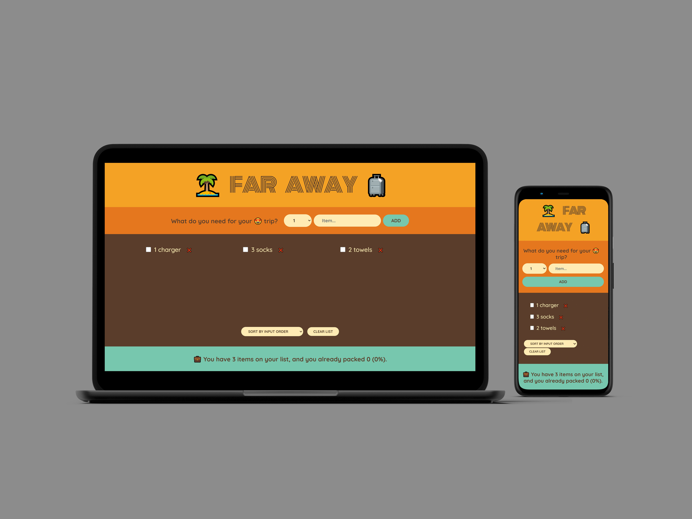

# **Far Away: Travel Packing List App**

## **Table of content:**

-   [Description](#description)
-   [Key Features](#key-features)
-   [Project Structure](#project-structure)
-   [Technical Highlights](#technical-highlights)
-   [Conclusion](#conclusion)

**Live demo** [click here](https://far-away-packing-list-app.netlify.app/)



---

### **Description:**

Far Away is a React-based application designed to help users organize their travel packing list efficiently. The app allows users to add items with quantity and description, check or delete items, sort them by different criteria, and clear the entire list. Items are persistently stored in the browser's local storage, ensuring the list remains intact even after refreshing the page.

---

### **Key Features:**

1. **Add Travel Items:**

    - Users can add items by entering the quantity and item name.

2. **Item Management:**

    - **Check Items:** Mark items as packed or unpacked.
    - **Delete Items:** Remove specific items from the list.

3. **Sorting Options:**

    - Sort items by:
        - **Packed Status:** Group packed and unpacked items.
        - **Input Order:** Preserve the order in which items were added.
        - **Description:** Alphabetically sort items by their name.

4. **Clear List:**

    - Users can clear all items from the list with a single action.

5. **Clear List:**

    - Display statistics the number of items in the list in addition to the number and percentage of packed items

6. **Local Storage Integration:**
    - Items are saved in the browser's local storage, ensuring persistence across sessions.

---

### **Project Structure:**

```
src
├── components
│   ├── Actions.js        # Handles actions like sorting and clearing the list
│   ├── Form.js           # Allows users to add new travel items
│   ├── Item.js           # Displays individual items with check and delete options
│   ├── Logo.js           # Displays the app's logo or branding
│   ├── PackingList.js    # Manages the main list of travel items
│   ├── Stats.js          # Displays statistics about packed and unpacked items
├── App.js                # Root component organizing the application layout
├── index.css             # Global styling for the application
├── index.js              # Entry point for rendering the React app
```

---

### **Technical Highlights:**

-   **React Features:**

    -   State management to handle items, sorting, and filtering.
    -   Modular components for better reusability and scalability.

-   **Local Storage:**

    -   Ensures the packing list is persistently stored, improving user experience.

-   **User-Friendly Interface:**
    -   Intuitive design with clear actions for adding, managing, and sorting items.

---

### **Conclusion:**

Far Away is a practical and user-friendly travel packing list app that simplifies the process of organizing items for trips. Its use of local storage, sorting options, and responsive design demonstrates strong React development skills and attention to user needs.
